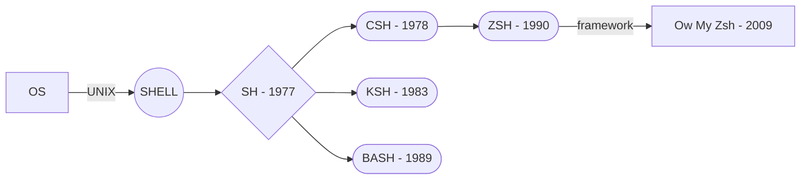

# O'mailles Zèdaihssache - Un peu de veille avant de commencer

***WAZAAAAA!!!!***


Ouais je sais on a déjà vu rapidement **UNIX** en **S01** mais maintenant qu'on a de la bouteille si on jette un oeil sur qu'est ce que **UNIX** on pourra voir qu'en réalité c'est limpide!

# "PTDR T KI ?"
***Bon!*** On va pas tous les voir parce que sinon ce serait trop long mais voici un petit graphique de la structure de notre **OS** jusqu'à **Ow My Zsh**.


***En gros!*** Notre *OS* (Système d'exploitation) possède un coeur *UNIX* qui tourne sur une distribution (*Linux*, *MacOS*...). Celui-ci possède un *SHELL* qui a évolué au fil du temps d'abord *SH* puis *BASH* (comme vous avez l'habitude d'utiliser) [et bien d'autres](https://www.journaldev.com/39194/different-types-of-shells-in-linux) ! 

Sur les distributions Linux *BASH* est installé **par défaut** sauf exception pour certains *OS*.
Vous pourrez retrouver les définitions techniques récupérées ***sans aucune vergogne*** dans le sommaire qu'est juste en dessous.

>Si t'as une flemmingite > Sommaire et tu pourras passer direct à la installation (j'me vexerai pas t'inquiète).

# ZSH
***Euh déjà... c'est bien beau Gugu mais tu me parles d'un truc j'sais même pas ce que c'est...***

***Et bien merci Google !*** 

Le Z shell ou zsh est un shell Unix qui peut être utilisé de façon interactive, à l'ouverture de la session ou en tant que puissant interpréteur de commande. zsh peut être vu comme un « Bourne shell » étendu avec beaucoup d'améliorations.

***Et avec des vrais mots ?***

Pour faire simple c'est un Bash amélioré, sans Ow My Zsh, je saurai pas te dire si ça vaut le coup de l'installer.
>Retient bien qu'en entreprise, ton équipe refusera peut être de travailler avec ZSH et Ow My Zsh, ce fut mon cas pendant mon alternance...

## Et pourquoi Ow My Zsh ?

***Parce que c'est beau!! Exactement comme un Koala...***


***As always... la définition que voici :***

Oh My Zsh est un **framework permettant de simplifier la configuration du shell Zsh**. Il permet d'ajouter un certain nombre de fonctionnalités bien utiles aux développeurs au travers de son mécanisme de plugins. En quelques chiffres, Oh My Zsh c'est : Plus de 106 000 stars sur GitHub. Rien que ça...
> Et oui Jammy, parce qu'un shell peut embarquer des frameworks qui eux même embarquent des plugins!

***Grâce à Ow My Zsh tu pourras :***

 - Customiser ton terminal afin de lancer des sorts avec de jolies couleurs en installant un thème
 - Avoir accès à des alias bash bien pratiques qui seront directement installé par défaut
 - Installer si tu le souhaites tes propres alias de ligne de commande
 - Passer d'un prompt complètement laid à un prompt bien clean et lisible

## Installation depuis la VM
Il est maintenant l'heure de passer à l'installation...
> Si t'as des soucis pour l'installer tu peux m'envoyer un message sur Slack maggle ou bien par téléphone au 118 218 numéro surtaxé évidemment!

#### Vérification de curl

Vérifier que curl est installé sur la machine :
```zsh
curl --version
 ```
Si curl n'est pas installé tu peux lancer ces 3 commandes d'affilé :
```zsh
sudo apt update
sudo apt upgrade
sudo apt install curl
 ```

#### Installation de Ow My Zsh
Lancer la commande :
```zsh
sh -c "$(curl -fsSL https://raw.githubusercontent.com/ohmyzsh/ohmyzsh/master/tools/install.sh)"
```
Si tu n'as pas d'erreur tu devrais voir affiché ceci :


>***BINUS*** des couleurs dans mon terminal!

***Pense à REDÉMARRER ta VM afin d'être sûr que tout s'est bien installé***
## Installation depuis l'hôte
***Je pars du principe que vous êtes pauvre et que vous ne possédez pas MacOS mais un bon vieux linux des familles!***
> Toutefois si vous possédez MacOS et que vous voulez l'installer sous MacOS je vous balance la doc d'installation à la fin du châpitre.
#### Installation de ZSH
Faire un petit update :
```zsh
sudo apt update
sudo apt upgrade
```
Installer zsh :
```zsh
sudo apt install zsh
```
Vérifier l'installation de zsh :
```zsh
zsh --version
```
#### Définition de ZSH comme shell par défaut
Définir ZSH comme shell par défaut :
```zsh
chsh -s $(which zsh)
```
> **NOTE** : Si jamais tu n'as pas la permission d'utiliser chsh, essaie avec **sudo**, si ça ne fonctionne toujours pas c'est que sur ta machine tu dois [procéder autrement](https://www.google.com/search?q=zsh%20default%20without%20chsh).
> 
Ferme tous tes terminaux, ouvre en un nouveau et assure toi que c'est installé :
```zsh
echo $SHELL
```
>Expected Output : `/bin/zsh`

Vérifier avec la commande :
```zsh
$SHELL --version
```
>Expected Output : `zsh 5.8`

#### Vérification de curl

Vérifier que curl est installé sur la machine :
```zsh
curl --version
 ```
Si curl n'est pas installé tu peux lancer ces 3 commandes d'affilé :
```zsh
sudo apt update
sudo apt upgrade
sudo apt install curl
 ```


#### Installation de Ow My Zsh
Lancer la commande :
```zsh
sh -c "$(curl -fsSL https://raw.githubusercontent.com/ohmyzsh/ohmyzsh/master/tools/install.sh)"
```
Si tu n'as pas d'erreur tu devrais voir affiché ceci :


>***BINUS*** des couleurs dans mon terminal!

***Pense à REDÉMARRER ta VM afin d'être sûr que tout s'est bien installé***

## Commandes utiles

La navigation dans le terminal change complètement avec Ow My Zsh.
Par exemple avec la commande :
```zsh
cd + TAB + TAB
```
> Tu peux naviguer avec les flèches de ton clavier ou bien incrémenter la sélection de 1 en spammant tabulation!

Quelques exemples de commandes utiles grâce aux alias de ZSH :

| BASH | Ow My Zsh  |
|--|--|
|`ls -ll`|`ll`|
|`ls -hart`|`l`|
|`cd ..`|`..`|
|`cd ../../sample`|`../../sample`|
|`cd /sample`|`/sample`|

#### L'auto-complétion révolutionné
Avec BASH, flèche du haut nous ressortait les dernières commandes lancées. Ow-My-Zsh ont poussé l'idée encore plus loins. Par exemple si je commence à taper la commande `git` + flèche du haut, ça va nous ressortir les dernières commandes mais lancées avec la commande `git`.


## Désinstallation de Ow My Zsh
Lancer la commande :
```zsh
uninstall_oh_my_zsh
```
>Essayer avec sudo si ça ne fonctionne pas
# Comment faire un alias de la street ?

# RTFM

## Installer un thème avec Ow My Zsh

## OS

## UNIX

## SHELL